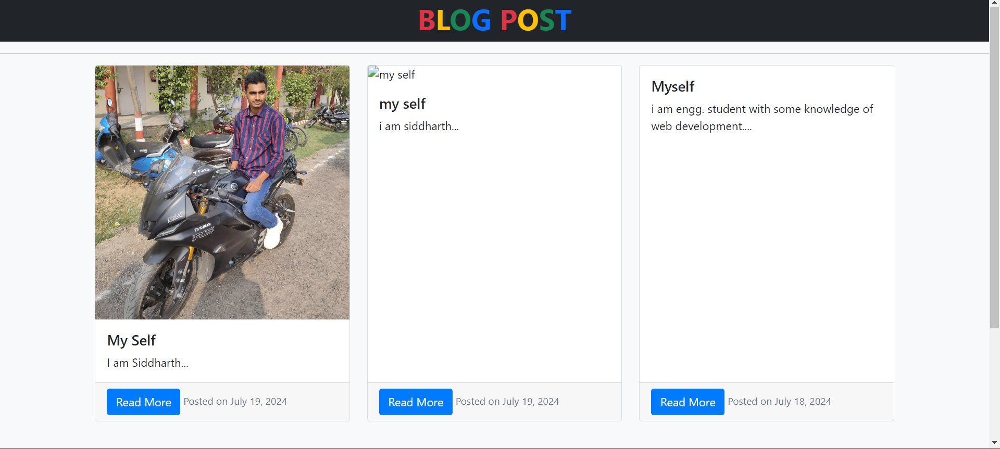
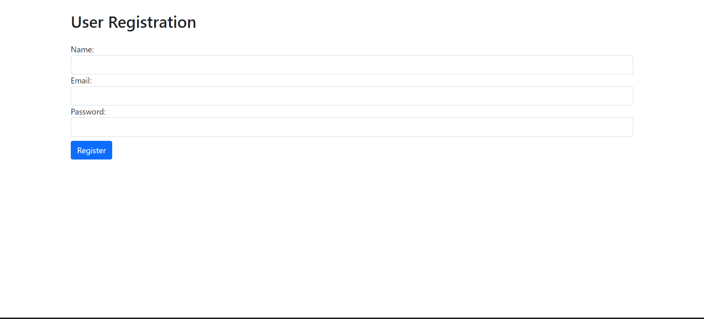
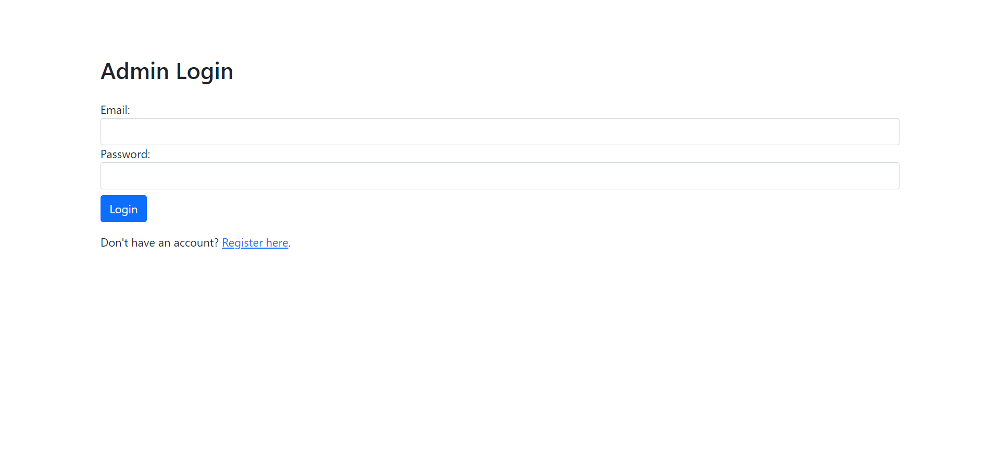
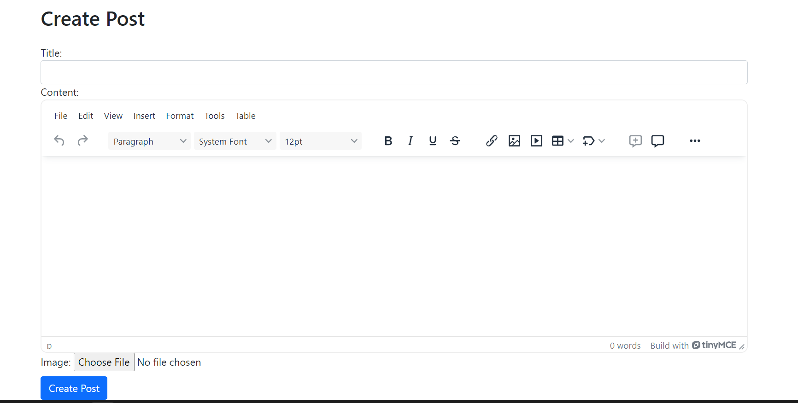
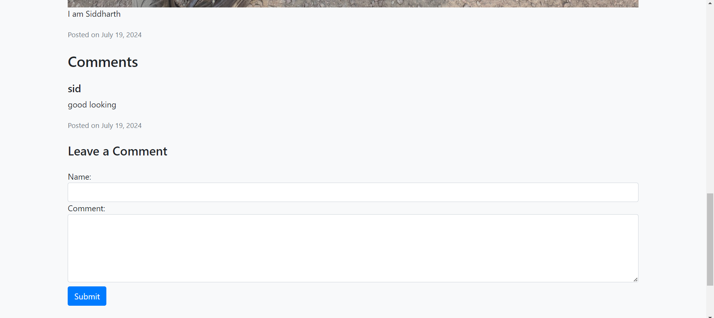
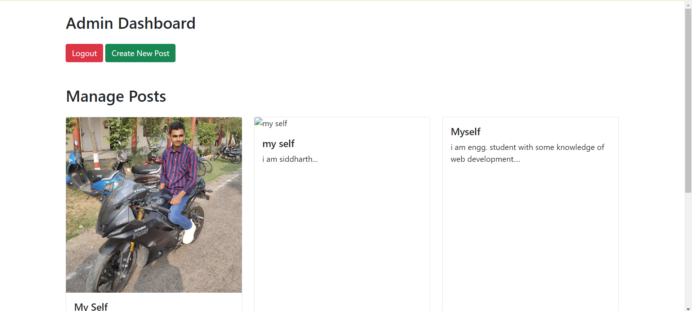

# Blogging Website

This is a simple blogging website built with PHP, MySQL, Bootstrap 5, jQuery, and TinyMCE. The website allows users to register, log in, create posts, and comment on posts. It includes an admin section for managing posts and comments.

## Features

- User registration and login
- Create, read, update, and delete posts
- Comment on posts
- Admin dashboard to manage posts and comments
- Rich text editor for creating posts (TinyMCE)
- Responsive design using Bootstrap 5

## Screenshots

### Homepage



### Registration Page



### Login Page



### Create Post Page



### Post View with Comments



### Admin Dashboard



## Requirements

- PHP 7.4 or higher
- MySQL 5.7 or higher
- Apache server (recommended: XAMPP)
- Composer (for dependency management)

## Installation

1. **Clone the repository:**
    ```bash
    git clone https://github.com/Sidd-Tiwari/blogging.github.io.git
    cd blogging.github.io
    ```

2. **Set up the database:**
    - Import the `database.sql` file into your MySQL database.
    - Update the `config.php` file with your database credentials:
      ```php
      <?php
      $servername = "localhost";
      $username = "your_database_username";
      $password = "your_database_password";
      $dbname = "your_database_name";

      // Create connection
      $conn = new mysqli($servername, $username, $password, $dbname);

      // Check connection
      if ($conn->connect_error) {
          die("Connection failed: " . $conn->connect_error);
      }
      ?>
      ```

3. **Install dependencies:**
    - Make sure you have Composer installed.
    - Run the following command to install TinyMCE:
      ```bash
      composer require tinymce/tinymce
      ```

4. **Set up the server:**
    - Place the project files in your web server's root directory (e.g., `htdocs` for XAMPP).
    - Start the Apache and MySQL services using XAMPP or another method.

5. **Configure TinyMCE:**
    - Sign up for an API key at [TinyMCE](https://www.tiny.cloud/).
    - Update the `create_post.php` file with your TinyMCE API key:
      ```html
      <script src="https://cdn.tiny.cloud/1/YOUR_API_KEY/tinymce/5/tinymce.min.js" referrerpolicy="origin"></script>
      ```

## Usage

1. **Access the website:**
    - Open your browser and navigate to `http://localhost/blogging-website`.

2. **Register a new user:**
    - Click on the "Register" link and fill out the registration form.

3. **Log in:**
    - Log in with your registered email and password.

4. **Create a new post:**
    - Once logged in, navigate to the "Create Post" page and use the rich text editor to create a new post.

5. **View and comment on posts:**
    - View the posts on the homepage and leave comments on individual posts.

6. **Admin Dashboard:**
    - Admin users can access the admin dashboard to manage posts and comments.

## Project Structure

```plaintext
/blogging-website/
├── admin/
│   ├── create_post.php
│   ├── dashboard.php
│   ├── delete_post.php
│   ├── edit_post.php
│   └── ...
├── assets/
│   ├── css/
│   │   └── style.css
│   ├── js/
│   │   └── script.js
│   └── ...
├── uploads/
├── config.php
├── index.php
├── login.php
├── logout.php
├── post.php
├── register.php
└── ...


## License

This project is licensed under the MIT License.

## Contributing
Contributions are welcome! Please fork the repository and submit a pull request for any improvements or bug fixes.